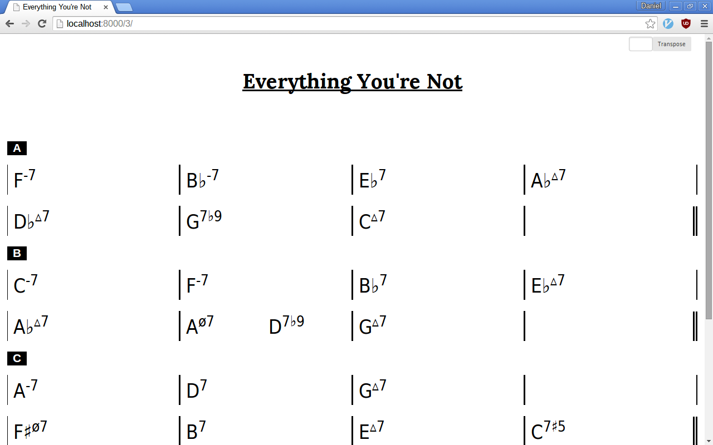
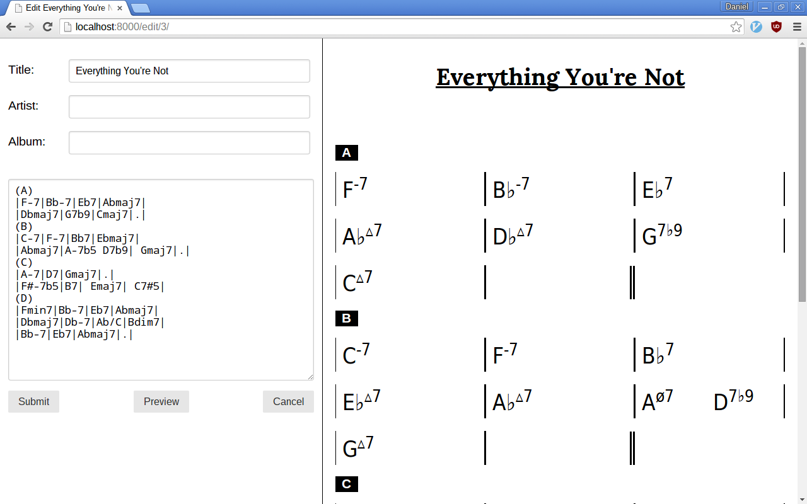
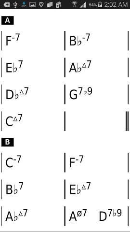

# Chordcharts
Django webapp that keeps a database of chord charts and displays them nicely and legibly.

Viewing a chart on a laptop:

Editing a chart on a laptop:

Viewing a chart on a smartphone:

### Dependencies 
This project depends on chords.py, a Python module I wrote that is available on my Github [here](https://github.com/danielhones/chords).  The module consists of only one file, so the easiest way to install it right now is to just download the file chords.py and place it in a directory in your Python path.  Eventually it will be available on PyPI.
